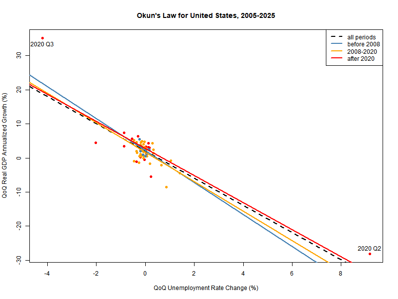

# The Stability of Okun's Law Across Time and Space: Evidence from the United States
This project hopes to answer two questions:
1. Is Okun's Law robust to major recessions?
2. Is Okun's Law homgeneous across the United States?

In short, the answer to (1) is **yes**, and the answer to (2) is **no**. More information is available in the paper below. Moreover, you can see the answer to (2) by playing with the interactive visualization.

## Interactive Tableau Visualization
Play with it [here](https://public.tableau.com/app/profile/eric.leonen1602/viz/OkunsLawAcrosstheUnitedStates/MainDashboard?publish=yes).

## Paper
Read it [here](https://drive.google.com/file/d/1X0vYUTDUBq5AYZpU16YYuxfxwuCONm03/view?usp=sharing).

**Abstract:**
This paper empirically examines how Okun's Law, the negative, linear relationship between output growth and unemployment rate changes, changes in the United States between periods marked by major recessions or across the states. Using historical output and unemployment data from 2005-2025, we fit linear models with interaction terms (for different periods or different states), to test for significant evidence for heterogeneity of slope term in a regression model of Okun's Law. Our results show no evidence of heterogeneity of Okun's Law across periods, and weak evidence across states. Our findings support the validity of Okun's Law notably using simple econometric models.

---
## Project Review (for me)
**Tech & Skills Practiced:** R-Studio, Linear Regression w/ Interactions, Econometrics, Hypothesis Testing, Tableau

**Accomplishments:**
  - Completed my first data analysis project 100% in R
  - Learned how to make maps, use a "dual axis", and set up filters/actions in Tableau
  - Learned how to use GitHub with R-Studio

**Possible Improvements:**
  - Could create dedicated folders for each section of code
  - Could have employed more functions for less repetitive code
