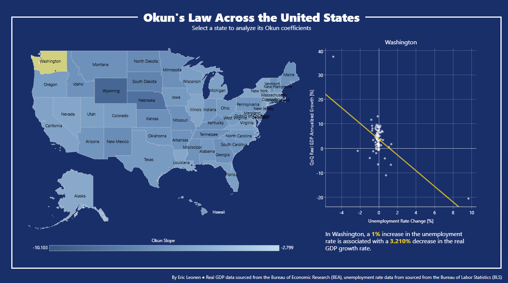

# The Stability of Okun's Law Across Time and Space: Evidence from the United States
This project hopes to answer two questions:
1. Is Okun's Law robust to major recessions?
2. Is Okun's Law homgeneous across the United States?

In short, the answer to (1) is **yes**, and the answer to (2) is **no**. More information is available in the paper below. Moreover, you can see the answer to (2) by playing with the interactive visualization.

## Interactive Tableau Visualization
Play with it [here](https://public.tableau.com/app/profile/eric.leonen1602/viz/OkunsLawAcrosstheUnitedStates/MainDashboard?publish=yes).

## Paper
*Coming soon!*
